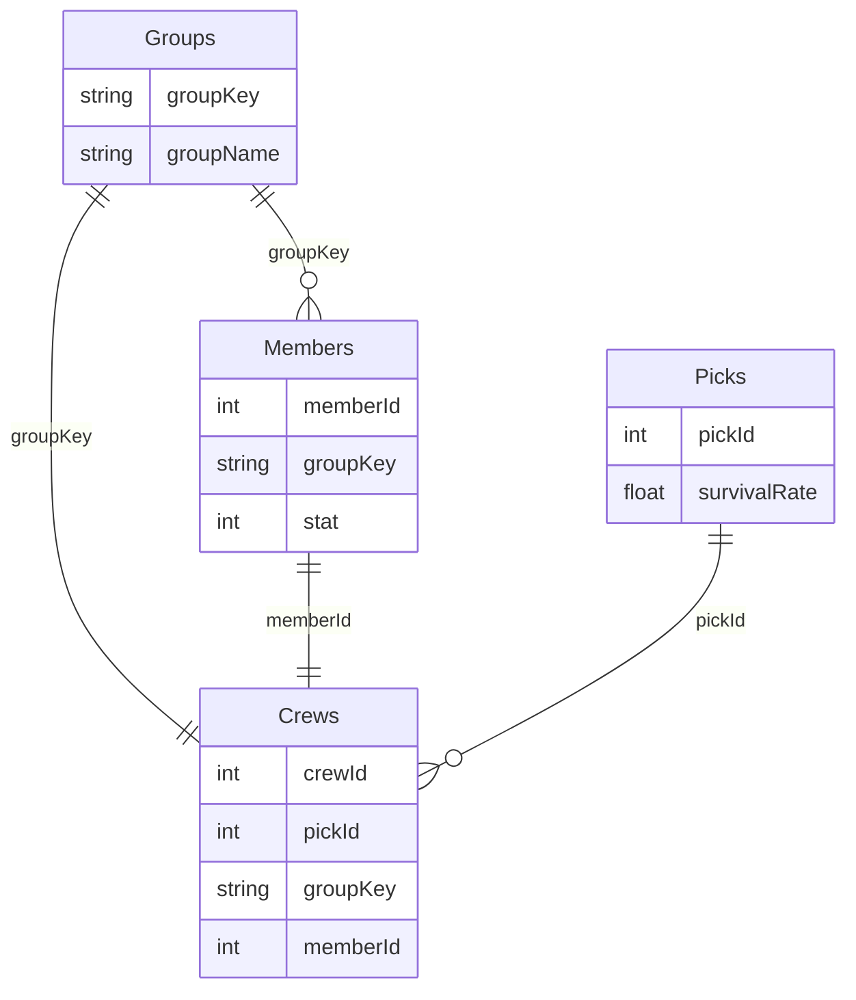

# Q2. MySQL 테이블 생성
```
Q1에서 실행한 함수의 조건과 결과를 저장할 수 있는 테이블 구조로 테이블 생성 쿼리를 작성해주세요.
```

# 테이블 스키마
테이블 | 필드 | 설명
-- | -- | --
Groups | | 그룹 테이블 (A, B, C, D)
| | groupKey | 그룹 키
| | groupName | 그룹 명
Members | | 멤버 테이블
| | memberId | 멤버 id
| | groupKey | 멤버가 속한 그룹 키
| | stat | 능력치
Crews | | 승무원 테이블
| | crewId | 승무원 id
| | pickId | 선발 id
| | groupKey | 그룹 키
| | memberId | 멤버 id
Picks | | 선발 회차별 성공률
| | pickId | 선발 id (선발 회차)
| | survivalRate | 성공률 계산 결과

# 다이어그램


# 테이블 생성 쿼리
```SQL
# 그룹
CREATE TABLE Groups (
    groupKey VARCHAR(10) NOT NULL PRIMARY KEY,
    groupName VARCHAR(100) NOT NULL
);

# 멤버
CREATE TABLE Members (
    memberId INT NOT NULL AUTO_INCREMENT PRIMARY KEY,
    groupKey VARCHAR(10) NOT NULL,
    stat INT COMMENT '능력치',
    FOREIGN KEY (groupKey) REFERENCES Groups(groupKey)
);

# 선발 회차별 성공률
CREATE TABLE Picks (
    pickId INT NOT NULL AUTO_INCREMENT PRIMARY KEY,
    survivalRate FLOAT
);

# 승무원
CREATE TABLE Crews (
    crewId INT NOT NULL AUTO_INCREMENT PRIMARY KEY,
    pickId INT NOT NULL,
    groupKey VARCHAR(10) NOT NULL,
    memberId INT NOT NULL,
    FOREIGN KEY (pickId) REFERENCES Picks(pickId),
    FOREIGN KEY (groupKey) REFERENCES Groups(groupKey),
    FOREIGN KEY (memberId) REFERENCES Members(memberId)
);
```
